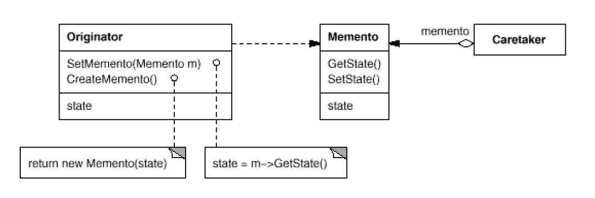

# Adapter

> Convert the interface of a class into another interface clients expect. Adapter
lets classes work together that couldn't otherwise because of incompatible
interfaces.


将一个类的接口转换成客户希望的另一个接口。适配器模式使原本不兼容而不能一起工作的那些类可以一起工作。

## Structure




```Target``` : 定义具体的客户端需要的接口

```java
package com.designpattern.adapter;

public interface Target {
    public void request();
}

```


```Adapter``` : 适配器，将Adaptee 适配到Target


```java

package com.designpattern.adapter;

public class Adapter implements Target {

    private Adaptee adapee = new Adaptee();

    @Override
    public void request() {
        System.out.println("adapter request.");
        adapee.realRequest();
    }

}


```

```Adaptee``` : 具体需要被适配的类或接口

```java
package com.designpattern.adapter;

public class Adaptee {
    public void realRequest() {
        System.out.println("real request!");
    }
}

```

```Client``` :

```java
package com.designpattern.adapter;

public class Client {
    public static void main(String[] args) {
        Target target = new Adapter();
        target.request();
    }
}

```