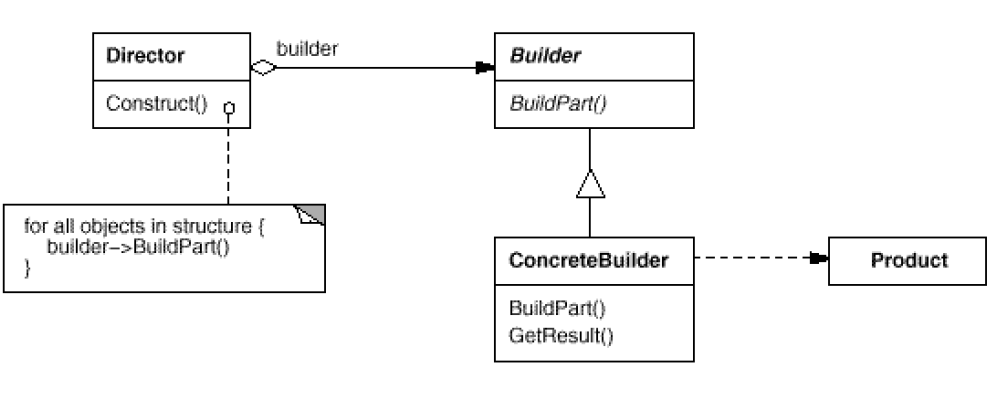

# Builder

> Separate the construction of a complex object from its representation so that
the same construction process can create different representations.

将一个复杂对象的构建与它的表示分离，使得同样的构建过程可以创建不同的表示。

## Structure



```Director``` :  指挥者，用于指挥建造过程。

```java

package com.designpattern.builder;

public class Director {
    public Builder builder = null;

    public Director(Builder builder) {
        this.builder = builder;
    }

    public void getResult() {
        builder.buildPartA();
        builder.buildPartB();
        builder.buildPartC();
    }
}


```


```Builder``` : 具体建造者的接口

```java
package com.designpattern.builder;

public interface Builder {
    void buildPartA();

    void buildPartB();

    void buildPartC();
}

```


```ConcreteBuilderA``` : 具体建造者A

```java

package com.designpattern.builder;

public class ConcreteBuilderA implements Builder {

    @Override
    public void buildPartA() {
        System.out.println("A : build A");
    }

    @Override
    public void buildPartB() {
        System.out.println("A : build B");
    }

    @Override
    public void buildPartC() {
        System.out.println("A : build C");
    }

}


```

```ConcreteBuilderB``` : 具体建造者B

```client``` :

```java

package com.designpattern.builder;

public class Client {
    public static void main(String args[]) {
        Builder builderA = new ConcreteBuilderA();

        Director directorA = new Director(builderA);

        directorA.getResult();

        Builder builderB = new ConcreteBuilderB();
        Director directorB = new Director(builderB);

        directorB.getResult();
    }
}


```

