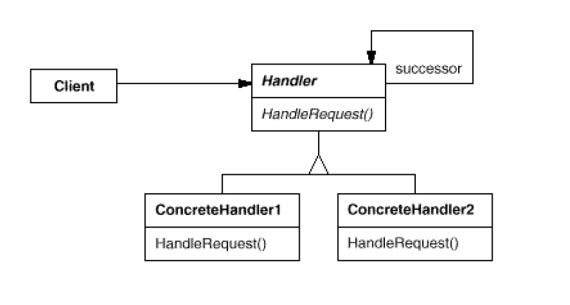

# 责任链模式

> Avoid coupling the sender of a request to its receiver by giving more than one object a chance to handle the request. Chain the receivingobjects and pass the
request along the chain until an objecthandles it.

使多个对象都有机会处理请求，从而避免请求的发送者和接收者之间的解耦关系。将这个对象连接成一条链，并沿着这条链传递
该请求知道有对象处理为止。

## Structure



```Handle``` : 定义一个处理请求的接口

```java

package com.designpattern.chainofresponsibility;

public interface Handler {

    void setHandler(Handler handler);

    void handleRequest(int level);
}


```


```ConcreteHanlerA``` : 具体的处理者，处理它所负责的请求。如果一个request在这里不能处理，

则转发给它的后继者.

```java
package com.designpattern.chainofresponsibility;

public class ConcreteHandlerA implements Handler {

    private Handler handler;

    @Override
    public void setHandler(Handler handler) {
        this.handler = handler;
    }

    @Override
    public void handleRequest(int level) {
        if (level < 5) {
            System.out.println("I'm A, I can hanle this.");
        } else {
            System.out.println("I'm A and I have no permission to hanle this request");
            handler.handleRequest(level);
        }
    }

}

```

