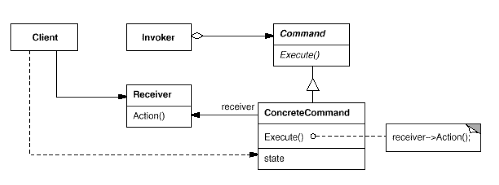

# Command

> Encapsulate a request as an object, thereby letting you parameterizeclients with
different requests, queue or log requests, and supportundoable operations.

将一个请求封装成一个对象，从而使你可用不同的请求对客户进行参数化；对请求排队或记录请求日志，以及支持可撤销操作

## Structure



```Command``` : 定义一个操作的接口

```java
package com.designpattern.command;

public interface Command {
    public void execute();
}


```


```ConcreteCommmand``` : 将一个接收者对象绑定一个动作，调用接收者相应的操作实现execute

```java

package com.designpattern.command;

public class ConcreteCommand implements Command {

    private Receiver receiver = new Receiver();

    @Override
    public void execute() {
        receiver.action();
    }

}


```


```Invoker``` : 要求该命令执行这个请求

```java
package com.designpattern.command;

import java.util.ArrayList;
import java.util.List;

public class Invoker {
    private List<Command> commands = new ArrayList<>();

    public void addCommand(Command command) {
        commands.add(command);
    }

    public void removeCommand(Command command) {
        commands.remove(command);
    }

    public void execute() {
        for (Command command : commands) {
            command.execute();
        }
    }
}

```


```Receiver``` : 知道如何实施与执行一个请求相关的操作，任何类都可能成为一个接收者

```java
package com.designpattern.command;

public class Receiver {
    public void action() {
        System.out.println("I am a developer.");
    }
}

```


```Client``` :

```java
package com.designpattern.command;

public class Client {
    public static void main(String[] args) {
        Invoker invoker = new Invoker();
        Command commandA = new ConcreteCommand();
        invoker.addCommand(commandA);

        invoker.execute();
    }
}

```
