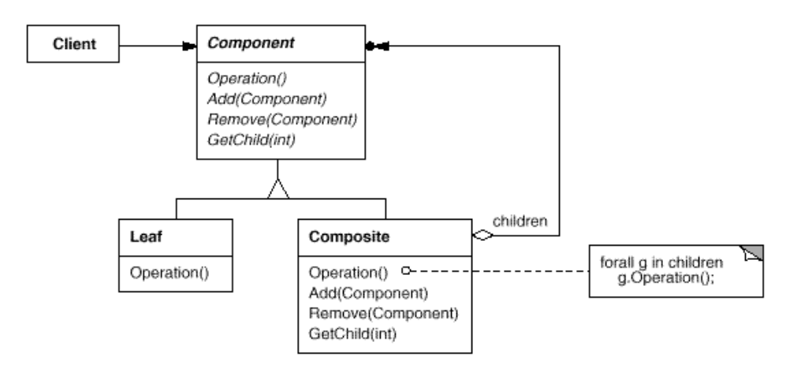

# Composite

> Compose objects into tree structures to represent part-whole hierarchies.
Composite lets clients treat individual objects and compositions of objects
uniformly.

将对象组合成树形结构以表示“整体——部分”的层次结构。组合模式使得用户对单个对象和组合对象的使用具有一致性

## Structure



```Componnt``` : 定义一个所有组合对象的接口，在适当的情况下实现可以有一些默认的行为。

```java

package com.designpattern.composite;

public interface Component {
    void addComponent(Component component);

    void removeComponent(Component component);

    void Operation();

    Component getChild(int child);

}


```


```Leaf``` : 表示组合中的叶子对象，叶节点没有子节点

```java

package com.designpattern.composite;

public class Leaf implements Component {

    private String name = null;

    public Leaf(String name) {
        this.name = name;
    }

    @Override
    public void addComponent(Component component) {

    }

    @Override
    public void removeComponent(Component component) {

    }

    @Override
    public void Operation() {
        System.out.println("I'm " + name);
    }

    @Override
    public Component getChild(int child) {
        // TODO Auto-generated method stub
        return null;
    }

}


```


```Composite``` : 表示组合中的子节点对象

```java
package com.designpattern.composite;

import java.util.ArrayList;
import java.util.List;

public class Composite implements Component {

    private List<Component> components = new ArrayList<>();

    private String name = null;

    public Composite(String name) {
        this.name = name;
    }

    @Override
    public void addComponent(Component component) {
        components.add(component);
    }

    @Override
    public void removeComponent(Component component) {
        components.remove(component);
    }

    @Override
    public void Operation() {

        System.out.println("I'm " + name);

        for (Component component : components) {
            component.Operation();
        }
    }

    @Override
    public Component getChild(int child) {
        return components.get(child);
    }

}


```


```Client``` :

```java
package com.designpattern.composite;

public class Client {
    public static void main(String[] args) {
        Component root = new Composite("root");
        Component componentA = new Composite("componentA");
        Component componentB = new Composite("componentB");

        Component componentAA = new Composite("componentAA");
        Component componentBB = new Composite("componentBB");

        Component rootLeaf = new Leaf("root leaf");
        Component aLeaf = new Leaf("A leaf");
        Component bLeaf = new Leaf("B leaf");

        root.addComponent(componentA);
        root.addComponent(componentB);
        root.addComponent(rootLeaf);

        componentA.addComponent(componentAA);
        componentB.addComponent(componentBB);
        componentA.addComponent(aLeaf);
        componentB.addComponent(bLeaf);

        root.Operation();

    }
}


```
