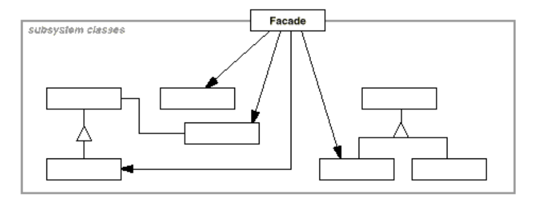

# Facade

> Provide a unified interface to a set of interfaces in a subsystem. Facade defines
a higher-level interface that makes the subsystem easier to use.

为子系统中的一组接口提供一个一致的界面，此模式定义了一个高层接口，这个接口使得这些子系统更加容易使用

## Structure

