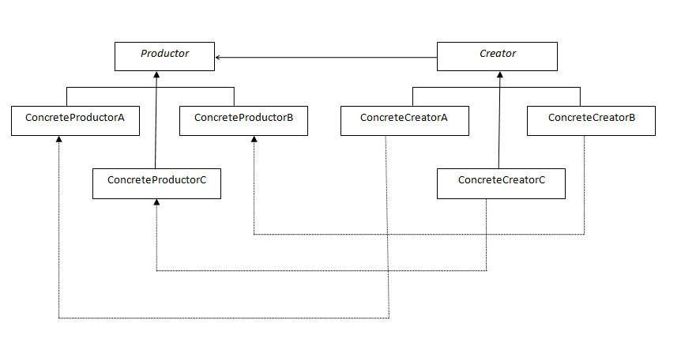

# Factory Method

> Define an interface for creating an object, but let subclasses decide which class
to instantiate. Factory Method lets a class defer instantiation to subclasses.

定义一个用于创建对象的接口，让子类决定实现哪个类。工厂方法使一个类的实例化延迟到其子类。

## Structure



```Productor``` : 定义产品的统一操作

```java

package com.designpattern.simplefactory;

public interface Productor {
    public void operation();
}

```


```ConcreteProductorA``` : 具体产品A

```java

package com.designpattern.simplefactory;

public class ConcreteProductorA implements Productor {

    public void operation() {
        System.out.println(this.getClass().getName());
    }
}

```

```ConcreteProductorB``` ：具体产品B

```ConcreteProductorC``` ：具体产品C


```Creator``` : 声明工厂方法，返回一个产品对象

```java

package com.designpattern.factory;

import com.designpattern.simplefactory.Productor;

public interface Creator {
    public Productor creator();
}

```


```ConcreteCreatorA``` : 具体工厂A

```java

package com.designpattern.factory;

import com.designpattern.simplefactory.ConcreteProductorA;
import com.designpattern.simplefactory.Productor;

public class ConcreteCreatorA implements Creator {

    @Override
    public Productor creator() {
        return new ConcreteProductorA();
    }

}

```

```Client``` :

```java
package com.designpattern.factory;

import com.designpattern.simplefactory.ConcreteProductorA;
import com.designpattern.simplefactory.Productor;

public class ConcreteCreatorA implements Creator {

    @Override
    public Productor creator() {
        return new ConcreteProductorA();
    }

}

```

