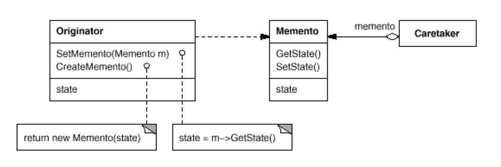

# Memento

> Without violating encapsulation, capture and externalize an object'sinternal
state so that the object can be restored to this state later.

在不破坏封装的前提下，捕获一个对象的内部状态，保存这个状态以便能够恢复这个状态。

## Structure



```Originator``` : 负责创建一个备忘录Memento用来记录当前时刻的内部状态。

```java

package com.designpattern.memento;

public class Originator {
    private String state = null;

    public String getState() {
        return state;
    }

    public void setState(String state) {
        this.state = state;
    }

    public void setMemento(Memento memento) {
        this.state = memento.getState();
    }

    public Memento createMemento() {
        Memento tmpMemento = new Memento();
        tmpMemento.setState(state);
        return tmpMemento;
    }
}


```


```Memento``` : 负责存储Originator的内部状态。

```java

package com.designpattern.memento;

public class Memento {
    private String state;

    public String getState() {
        return state;
    }

    public void setState(String state) {
        this.state = state;
    }

}


```

```Caretaker``` ： 用来保存Memento的一个bean

```java

package com.designpattern.memento;

public class Caretaker {
    private Memento memento;

    public Memento getMemento() {
        return memento;
    }

    public void setMemento(Memento memento) {
        this.memento = memento;
    }

}


```

```client``` :

```java

package com.designpattern.memento;

public class Client {

    public static void main(String[] args) {
        Originator originator = new Originator();
        originator.setState("Hello, I am A");
        System.out.println(originator.getState());

        Caretaker caretaker = new Caretaker();
        caretaker.setMemento(originator.createMemento());

        originator.setState("Hello, I am B");
        System.out.println(originator.getState());

        originator.setMemento(caretaker.getMemento());
        System.out.println(originator.getState());

    }
}


```


