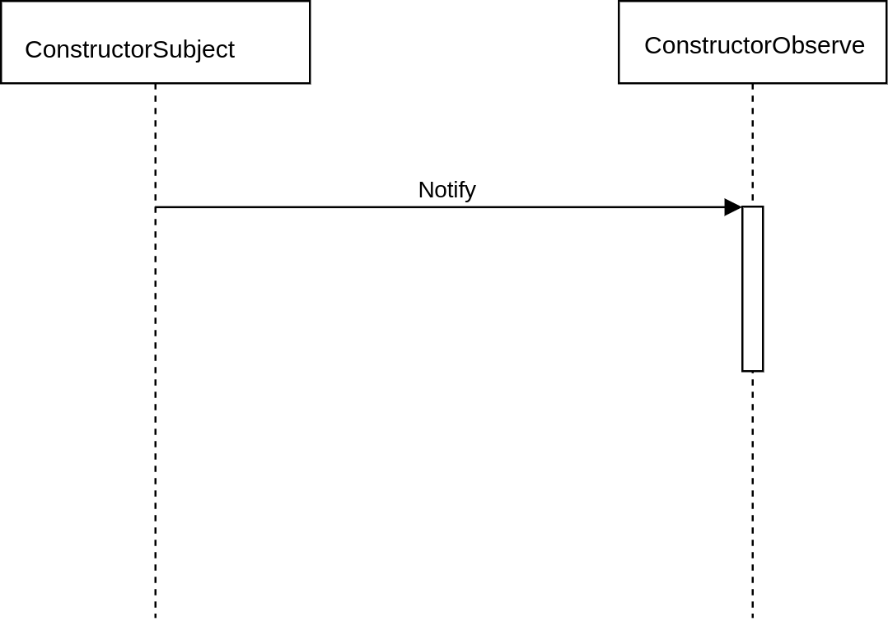

# Observer

---
> “ defne a one-to-many dependency between objects so that when one object changes
state, all its dependents are notified and updated automatically."
> -- *Design Patterns ： Elements of Reusable Object-Oriented Software*

观者者模式，又叫发布-阅模式。它定义了一种一对多的关系使得一个被订阅（观察）对象的状态发生改变，所有订阅这个对象的对象都能自动更新自己。
   
   

## Structure

* 观察者结构图


```Subject``` : 又被称为```observable```,它的作用把所有observe的引用保存在一个聚集中（```List```比如），可以添加新的```observe```，移除已经存在的```observe```。一般用一个接口来实现

```Observe``` : 为所有的观察者提供一个统一的接口，作用是在得到跟新指令的时候更新自己。

```ConstructorSubject``` : 将具体的Observe存入聚集中。当```ConstructorSubject```中的状态改变或者某些条件发生时，给所有登记过的observe发出更新通知。

```ConstructorObserve``` : 具体观察者对象，得到通知的时候更新自己。

* 观察者模式代码

```Observe```

```java
package com.designpattern.observe;

public interface Observe {
    void notify2();
}

```
```Subject```

```java
package com.designpattern.observe;

public interface Subject {
    void attach(Observe observe);

    void detach(Observe observe);

    void notify2();

}


```

```ConstructorSubject```

```java

package com.designpattern.observe;

import java.util.ArrayList;
import java.util.List;

public class ConstructorSubject implements Subject {

    private List<Observe> observes = new ArrayList<Observe>();

    public void attach(Observe observe) {
        observes.add(observe);
    }

    public void detach(Observe observe) {
        observes.remove(observe);
    }

    public void notify2() {
        for (Observe observe : observes) {
            observe.notify2();
        }
    }

}

```

```ConstructorObserve```

```java

package com.designpattern.observe;

public class ConstructorObserve implements Observe {

    private String observeStatus;

    public ConstructorObserve(String observeStatus) {
        this.observeStatus = observeStatus;
    }

    public void notify2() {
        System.out.println(observeStatus);
    }

}

```
```client``` 调用示例：

```java
package com.designpattern.observe;

import java.util.Random;

public class Client {
    public static void main(String[] args) {
        Subject subject = new ConstructorSubject();
        Observe observe1 = new ConstructorObserve("observe1");
        Observe observe2 = new ConstructorObserve("observe2");

        subject.attach(observe1);
        subject.attach(observe2);

        while (true) {
            int randValue = new Random().nextInt(100);
            if (randValue == 50) {
                subject.notify2();
                break;
            }
        }
    }
}


```


## 时序图



## 使用场景


## jdk中的应用


## 总结


