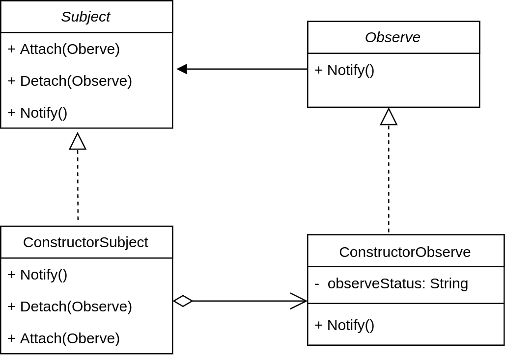

# Observer

---
> “ defne a one-to-many dependency between objects so that when one object changes
state, all its dependents are notified and updated automatically."

> -- *Design Patterns ： Elements of Reusable Object-Oriented Software*

观者者模式，又叫发布-阅模式。它定义了一种一对多的关系使得一个被订阅（观察）对象的状态发生改变，所有订阅这个对象的对象都能自动更新自己。
   
   

## Structure

* 观察者结构图



```Subject``` : 又被称为```observable```,它的作用把所有observe的引用保存在一个聚集中（```List```比如），可以添加新的```observe```，移除已经存在的```observe```。一般用一个接口来实现

```Observe``` : 为所有的观察者提供一个统一的接口，作用是在得到跟新指令的时候更新自己。

```ConstructorSubject``` : 将具体的Observe存入聚集中。当```ConstructorSubject```中的状态改变或者某些条件发生时，给所有登记过的observe发出更新通知。

```ConstructorObserve``` : 具体观察者对象，得到通知的时候更新自己。

* 观察者模式代码

```Observe```

```java
package com.designpattern.observe;

public interface Observe {
    void notify2();
}

```
```Subject```

```java
package com.designpattern.observe;

public interface Subject {
    void attach(Observe observe);

    void detach(Observe observe);

    void notify2();

}


```

```ConstructorSubject```

```java

package com.designpattern.observe;

import java.util.ArrayList;
import java.util.List;

public class ConstructorSubject implements Subject {

    private List<Observe> observes = new ArrayList<Observe>();

    public void attach(Observe observe) {
        observes.add(observe);
    }

    public void detach(Observe observe) {
        observes.remove(observe);
    }

    public void notify2() {
        for (Observe observe : observes) {
            observe.notify2();
        }
    }

}

```

```ConstructorObserve```

```java

package com.designpattern.observe;

public class ConstructorObserve implements Observe {

    private String observeStatus;

    public ConstructorObserve(String observeStatus) {
        this.observeStatus = observeStatus;
    }

    public void notify2() {
        System.out.println(observeStatus);
    }

}

```
```client``` 调用示例：

```java
package com.designpattern.observe;

import java.util.Random;

public class Client {
    public static void main(String[] args) {
        Subject subject = new ConstructorSubject();
        Observe observe1 = new ConstructorObserve("observe1");
        Observe observe2 = new ConstructorObserve("observe2");

        subject.attach(observe1);
        subject.attach(observe2);

        while (true) {
            int randValue = new Random().nextInt(100);
            if (randValue == 50) {
                subject.notify2();
                break;
            }
        }
    }
}


```


## 时序图


## 使用场景

假如现有这么一个场景：

一个文件夹监视器，当文件夹中的文件发生改变（增加，删除，修改）时，根据文件的不同类别以及不同改变作出相对应的动作。需要注意的是，需要监视的文件类型有可能会发生改变，有可能增多，也有可能减少。

分析一下这个需求，文件监视器监视文件夹里文件的变化，那文件的变化就应该是监视器的内部状态。当这些内部状态发生变化的时候，通知相应的订阅者作出相应的更新（或变化）。

对于监视器来说，它的职责只是负责捕捉“文件的变化”（不然当需要增加新的文件类型时，就需要改源代码了，这就违背了“开闭原则”了）并通知它的订阅者。

对于订阅者来说，它需要能够区分不同的文件类新，不同的操作。

UML 图如下：


```WatchServiceSubject``` ： 监视器，负责捕捉文件的变化。

```WatchServicerObsever```  ： 观者者接口

```XmlObsever``` ： Xml的观察者

```TxtObsever``` ： Txt的观察者

```LogObsever``` ： Log的观察者


```WatchServiceSubject```  :

```java

package com.designpattern.observe.example;

import static java.nio.file.StandardWatchEventKinds.ENTRY_CREATE;
import static java.nio.file.StandardWatchEventKinds.ENTRY_DELETE;
import static java.nio.file.StandardWatchEventKinds.ENTRY_MODIFY;
import static java.nio.file.StandardWatchEventKinds.OVERFLOW;

import java.io.IOException;
import java.nio.file.FileSystems;
import java.nio.file.Path;
import java.nio.file.Paths;
import java.nio.file.WatchEvent;
import java.nio.file.WatchKey;
import java.nio.file.WatchService;
import java.util.ArrayList;
import java.util.List;

public class WatchServiceSubject {
    private List<WatchServicerObsever> obsevers = new ArrayList<WatchServicerObsever>();

    private WatchService watcher = null;

    public WatchServiceSubject(String path) throws IOException {
        watcher = FileSystems.getDefault().newWatchService();
        Paths.get(path).register(watcher, ENTRY_CREATE, ENTRY_DELETE, ENTRY_MODIFY, OVERFLOW);
    }

    public void addObsever(WatchServicerObsever obsever) {
        obsevers.add(obsever);
    }

    public void removeObsever(WatchServicerObsever obsever) {
        obsevers.remove(obsever);
    }

    public void update(String operation, String fileName) {
        for (WatchServicerObsever obsever : obsevers) {
            obsever.update(operation, fileName);
        }
    }

    public void watch() {
        for (;;) {
            // wait for key to be signaled
            WatchKey key;
            try {
                key = watcher.take();
            } catch (InterruptedException x) {
                return;
            }

            for (WatchEvent<?> event : key.pollEvents()) {
                WatchEvent.Kind<?> kind = event.kind();

                if (kind == OVERFLOW) {
                    continue;
                }

                WatchEvent<Path> ev = (WatchEvent<Path>) event;
                Path filename = ev.context();

                // when changes happend, notify all obsevers
                update(kind.toString(), filename.toAbsolutePath().toString());
            }

            boolean valid = key.reset();
            if (!valid) {
                break;
            }
        }
    }
}

```

```WatchServicerObsever```  : 

```java
package com.designpattern.observe.example;

public interface WatchServicerObsever {
    void update(String operation, String fileName);
}


```


```XmlObsever```  : 

```java
package com.designpattern.observe.example;

public class XmlObsever implements WatchServicerObsever {

    private static final String XML_SUFFIX = ".xml";

    public void update(String operation, String fileName) {
        if (null != fileName && fileName.endsWith(XML_SUFFIX)) {
            System.out.println("You are " + operation + " a xml file " + fileName);
        }
    }

}

```


## jdk中的应用


## 总结


