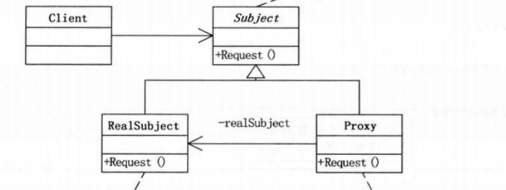

# Proxy

> Provide a surrogate or placeholder for another object to control access to it.

为其他对象提供一种代理以控制对这个对象的访问

## Stricture




```Subject``` : 定义RealObject和Proxy共用的接口

```java

package com.designpattern.proxy;

public interface Subject {
    void request();
}


```


```RealSubject``` : 定义Proxy所代表的真实实体

```java

package com.designpattern.proxy;

public class RealObject implements Subject {

    @Override
    public void request() {
        System.out.println("I am the real request.");
    }

}


```


```Proxy``` : 保存一个引用使得代理可以访问实体

```java

package com.designpattern.proxy;

public class Proxy implements Subject {

    private Subject realObject = new RealObject();

    @Override
    public void request() {
        realObject.request();
    }

}


```


```Client``` :

```java
package com.designpattern.proxy;

public class Client {
    public static void main(String[] args) {
        Subject subject = new Proxy();
        subject.request();
    }
}

```