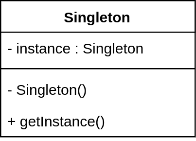

# Singleton

---
> "Ensure a class only has one instance, and provide a global point of access to
it.

> -- *Design Patterns Elements of Reusable Object-Oriented Software*

单例模式，顾名思义，就是保证一个类只有一个实例并为这个类提供一个全局的访问点。
   
   

## Structure

* 单例模式结构图



```Singleton```： 定义一个```getInstance```方法让外界调用其唯一的实例。

* 单例模式代码
```java
public class Singleton {
    private static Singleton instance = new Singleton();

    private Singleton() {
    }

    public Singleton getInstance() {
        return instance;
    }
	
	// other functions
}
```

## 时序图


## 使用场景

在java中，单例模式有很对种实现的方式，先面就列举我知道的一些。

* 饿汉式单例

```java
public class Singleton {
    private static Singleton instance = new Singleton();

    private Singleton() {
    }

    public static Singleton getInstance() {
        return instance;
    }
	
	// other functions
}
```

饿汉式是典型的空间换时间，当类装载的时候就会创建类的实例，不管你用不用，先创建出来，然后每次调用的时候，就不需要再判断，节省了运行时间。在上面的代码中，由于instance在类加载的时候就已就被实例化，所以当真正有其他的client调用getInstance的时候，instance已经准备好了。
因为static变量在jvm中只会有一份，所以饿汉式单例也不会有多线程的问题。

* 懒汉式单例

“懒汉”也是一种形象的说法，既然比较“懒”，那就等用的时候在创建这个实例好了。

 同步方法的饿汉式单例：
 
 ```java
 package com.designpattern.singleton;

public class LazySingleton {
    private static LazySingleton instance = null;

    private LazySingleton() {
    }

    public static synchronized LazySingleton getInstance() {
        if (null == instance) {
            instance = new LazySingleton();
        }
        return instance;
    }

}

```
 
 
双重检查饿汉式单例：

```java

package com.designpattern.singleton;

public class LazySingleton {
    private static LazySingleton instance = null;
    static Object lock = new Object();

    private LazySingleton() {
    }

    public static LazySingleton getInstance() {
        if (null == instance) {
            synchronized (lock) {
                if (null == instance) {
                    instance = new LazySingleton();
                }
            }
        }
        return instance;
    }
}

```
这里给出了两种能够在多线程环境中安全运行的饿汉式单例模式，虽然他们都能安全的在多线程环境中安全使用，但是都有一定的性能消耗。先来看第一种：
```synchronized```保证了同时刻只有一个线程访问```getInstance```方法，当第一个线程获得锁并进入该方法，此时```instance```为```null```，所以该线程创建了一个```LazySingleton```对象。等第一个线程执行完以后，下一个线程获得锁，进入方法，此时```instance```已经不为```null```了，直接返回。
这种实现方式的弊端在于，同一时刻只有一个线程能够访问该方法，在多线程环境中，就会造成很多线程等待的问题，降低了效率。

再来看第二种，双重检查实现的方式：
和第一种不同的是，线程并不是每次进入```getInstance```方法都需要同步，而是先不同步，进入方法后，先检查实例是否存在，如果不存在才进行下面的同步块，这是第一重检查，进入同步块过后，再次检查实例是否存在，如果不存在，就在同步的情况下创建一个实例，这是第二重检查。这样一来，就只需要同步一次了，从而减少了多次在同步情况下进行判断所浪费的时间。

这种实现方式确实是比第一中同步方法实现的方式要高级一些，双重检查只会发生在多个线程第一次同时调用```getInance```的时候发生，后面再调用的时候就直接返回。它的缺点也出现在这里，双重检查只发生在第一次调用，写那么多只是为了使用一次？似乎有点不太友好。

* 内部类单例


## 总结
* How would you create a single object?


