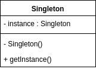

# Singleton

---
> "Ensure a class only has one instance, and provide a global point of access to
it.

> -- *Design Patterns Elements of Reusable Object-Oriented Software*

单例模式，顾名思义，就是保证一个类只有一个实例并为这个类提供一个全局的访问点。
   
   

## Structure

## 时序图

## 代码实现

## 使用场景

## 总结
* How would you create a single object?

