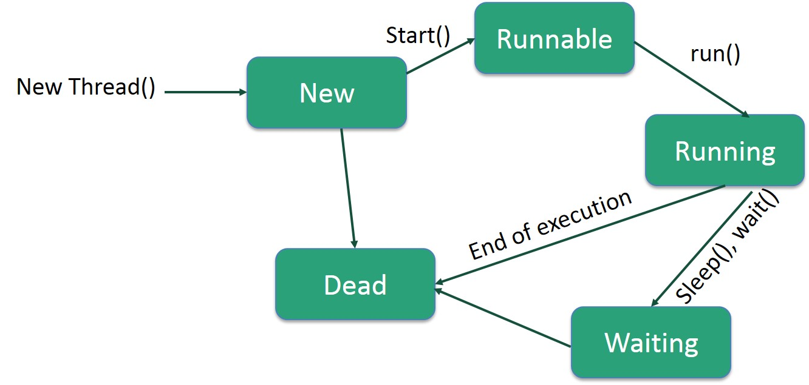

## 线程
-----

### 线程和进程
#### 进程
>进程是正在运行的程序的实例（an instance of a computer program that is being executed)。它是操作系统动态执行的基本单元，在传统的操作系统中，进程既是基本的分配单元，也是基本的执行单元。

#### 线程
>线程，有时被称为轻量级进程(Lightweight Process，LWP），是程序执行流的最小单元。线程是进程中的一个实体，是被系统独立调度和分派的基本单位，线程自己不拥有系统资源，只拥有一点儿在运行中必不可少的资源（堆栈，指令寄存器等）。

### 线程的创建
java创建线程的方式有两种,一种是继承```Thread```类,另外一种是实现```Runnable```接口。

继承```Thread```类：
```java
public class MyThread extends Thread {

    @Override
    public void run() {
        // do something
        System.out.println(this.getName());
    }

    public static void main(String[] args) {
        new MyThread().start();
    }
}
```

实现```Runnable```接口:
```java
 public static void main(String[] args) {

        Thread t = new Thread(new Runnable() {

            public void run() {
                // do something
                System.out.println("Thread t");
            }
        });

        t.start();
    }
```


### 线程的状态以及状态之间的转换
线程的状态

New:

当线程被创建时，它只会短暂的处于这种状态，这时系统已经为它分配了必要的资源，并执行了初始化。此时已经具备了获取系CPU时间的资格。

Runnable:
这种状态是介于已经调用```start()```方法但是还有获得系统时间的状态。在这种状态下，只要调度器把时间分给这个线程，该线程立马就可以开始执行。简单来说，在这种状态下线程可运行也可不运行，这取决与是否得到了系统时间。

Blocked :
线程能够运行，但是某个条件阻止了它的运行。当线程处于这个状态的时候，CPU调度器不会把系统时间分给它直到线程重新进入Runnable的状态，它才有可能执行。

Dead：
当线程正常执行完任务从```run()```返回或者意外终止时，线程处于死亡状态，线程不在有机会获得任何CPU时间。
<br>

（图片来源于网络，侵删）

### 捕获异常
>由于线程的v本质，使得你你不能捕获从线程中逃逸的异常，一旦异常逃逸出```run()```方法，它就会传播到控制台。
《Java编程思想》

如下面程序所示，即使添加try-catch也没有作用：
```java
public class CatchThreadException {

    class ExceptionRunnable implements Runnable {

        public void run() {
            throw new RuntimeException();
        }

    }

    public void threadStart() {
        new Thread(new ExceptionRunnable()).start();
    }

    public static void main(String[] args) {

        try {
            new CatchThreadException().threadStart();
        } catch (RuntimeException e) {
            System.out.println("runtime exception!");
        }
    }

}
```
为了解决这个问题，java SE5中增加了一个新接口```UncaughtExceptionHandler```：
```java
 public interface UncaughtExceptionHandler {
        /**
         * Method invoked when the given thread terminates due to the
         * given uncaught exception.
         * <p>Any exception thrown by this method will be ignored by the
         * Java Virtual Machine.
         * @param t the thread
         * @param e the exception
         */
        void uncaughtException(Thread t, Throwable e);
    }
```
正如注释中描述的那样，当运行在线程中的代码抛出异常导致线程终止的时候，这个方法就会被调用。
使用的话也非常简单，只需要在线程中调用```setUncaughtExceptionHandler```就可以了。

```java
public void setUncaughtExceptionHandler(UncaughtExceptionHandler eh) {
        checkAccess();
        uncaughtExceptionHandler = eh;
}
```
调用```setUncaughtExceptionHandler```捕获线程异常

```java
    class ExceptionRunnable implements Runnable {

        public void run() {
            throw new RuntimeException("exception in run() ");
        }

    }

    class ThreadExceptionHandler implements UncaughtExceptionHandler {

        public void uncaughtException(Thread t, Throwable e) {
            System.out.println("uncaughtException : " + " " + t.getName() + "  " + e.getMessage());
        }
    }

    public void threadStart() {
        Thread task = new Thread(new ExceptionRunnable());
        task.setUncaughtExceptionHandler(new ThreadExceptionHandler());
        task.start();
    }

    public static void main(String[] args) {
        new CatchThreadException().threadStart();
    }

    //output : uncaughtException :  Thread-0  exception in run()
```


* main thread 停止以后其他线程不受影响
```java
    public static void main(String[] args) {
        Thread t = new Thread(new Runnable() {
            public void run() {
                try {
                    Thread.sleep(2000);
                } catch (InterruptedException e) {
                    e.printStackTrace();
                }
                System.out.println(Thread.currentThread().getName());
            }
        });
        t.setName("thread t");
        t.start();
        System.out.println("main thread over!");
    }

    // output :main thread over! , thread t
```

* ```sleep()``` 和 ```wait()```的区别

 ```wait()```是```Objectde```方法，```sleep()```是线程里面的方法。
 线程调用```wait()```的时候会让出锁，```sleep()```不会。
 ```sleep()```会抛出异常，```wait()```不会。
Thread.Sleep(0)的作用是“触发操作系统立刻重新进行一次CPU竞争”。

* ```Runnable``` 和 ```Callable```

```Runnable```

线程驱动任务，那任务就需要一种描述方式，在java中，这也就是```Runnable```的作用。在实现多线程的过程中，只需要任务体放在```run()```方法中并将这个任务附着在一个线程上，就可以实现多线程。```Runnable```中的```run()```方法不带返回值


```Callable```

```Callable```的功能和```Runnable```类似，只是```Callable```中的方法是```call()```,这个方法是带有返回值的。


* ```Executor``` 

```java
public interface Executor {

    /**
     * Executes the given command at some time in the future.  The command
     * may execute in a new thread, in a pooled thread, or in the calling
     * thread, at the discretion of the <tt>Executor</tt> implementation.
     *
     * @param command the runnable task
     * @throws RejectedExecutionException if this task cannot be
     * accepted for execution.
     * @throws NullPointerException if command is null
     */
    void execute(Runnable command);
}
```
> An object that executes submitted Runnable tasks. This interface provides a way of decoupling task submission from the mechanics of how each task will be run, including details of thread use, scheduling, etc. An Executor is normally used instead of explicitly creating threads. For example, rather than invoking new Thread(new(RunnableTask())).start() for each of a set of tasks, you might use:

根据 java doc的说法，这是一个用来执行提交的Runnable 任务。```Executor```提供了一种将任务提交与每个任务如何运行的机制分离的方法，包括线程使用、调度等细节。```Executor```通常被用来代替显示的创建线程。

* ```ExecutorService```

> An Executor that provides methods to manage termination and methods that can produce a Future for tracking progress of one or more asynchronous tasks.
An ExecutorService can be shut down, which will cause it to reject new tasks. Two different methods are provided for shutting down an ExecutorService. The shutdown() method will allow previously submitted tasks to execute before terminating, while the shutdownNow() method prevents waiting tasks from starting and attempts to stop currently executing tasks. Upon termination, an executor has no tasks actively executing, no tasks awaiting execution, and no new tasks can be submitted. An unused ExecutorService should be shut down to allow reclamation of its resources.
Method submit extends base method Executor.execute(java.lang.Runnable) by creating and returning a Future that can be used to cancel execution and/or wait for completion. Methods invokeAny and invokeAll perform the most commonly useful forms of bulk execution, executing a collection of tasks and then waiting for at least one, or all, to complete. (Class ExecutorCompletionService can be used to write customized variants of these methods.)
The Executors class provides factory methods for the executor services provided in this package.

```ExecutorService```是一个比Executor使用更广泛的子类接口，其提供了生命周期管理的方法，以及可跟踪一个或多个异步任务执行状况返回Future的方法


* ```Executors```

> Factory and utility methods for Executor, ExecutorService, ScheduledExecutorService, ThreadFactory, and Callable classes defined in this package.

简单来说，就是提供一系列的方法获取各种线程池。


* ```newFixedThreadPool```
> Creates a thread pool that reuses a fixed number of threads operating off a shared unbounded queue.

创建一个有给定数量线程的线程池，在任何时候，池中的线程都是可用的。当所有线程都处于活动状态的时候，新提交的任务将被排队等待直到有线程可用。如果线程执行期间因发生意外而终止，那新的线程会占有这个终止线程的任务。```newFixedThreadPool```中的线程会一直存在，直到它被明确关闭。

* ```newSingleThreadExecutor```

> Creates an Executor that uses a single worker thread operating off an unbounded queue. (Note however that if this single thread terminates due to a failure during execution prior to shutdown, a new one will take its place if needed to execute subsequent tasks.)

创建一个新的只有一个工作线程的Executor。如果这个工作线程在Executor关闭前因为执行失败而终止，一个新的线程会继续执行后续任务直至完成。```newSingleThreadExecutor```保证任务是被顺序执行的，在任何时间，最多只有一个线程是出于活动状态。

* ```newCachedThreadPool```

> Creates a thread pool that creates new threads as needed, but will reuse previously constructed threads when they are available, and uses the provided ThreadFactory to create new threads when needed.

创建一个当有需要的时候才会去创建新线程的线程池。在执行任务的过程中，如果池中有线程可用的话，则会重用的这些线程；如果没有可用的线程，则将创建新的线程并将其添加到池中。未使用60秒的线程被终止并从缓存中删除。因此，一个长期闲置的池将不会消耗任何资源。

* ```newSingleThreadScheduledExecutor```

> Creates a single-threaded executor that can schedule commands to run after a given delay, or to execute periodically.   Tasks are guaranteed to execute sequentially, and no more than one task will be active at any given time.

创建一个单线程执行程序，它可以调度命令在给定的延迟之后运行，或者定期执行。任务被顺序执行，在任何给定的时间，最多只有一个任务在执行。

* ```newScheduledThreadPool```

> Creates a thread pool that can schedule commands to run after a given delay, or to execute periodically.

创建一个线程池，该线程池可以调度命令在给定的延迟之后运行，或者定期执行。


* ```CountDownLatch``` 和 ```CyclicBarrier```


[ConcurrentHashMap](https://www.ibm.com/developerworks/cn/java/java-lo-concurrenthashmap/index.html)

[volatile](http://www.cnblogs.com/dolphin0520/p/3920373.html)

[ThreadLocal](http://www.iteye.com/topic/103804)

[ThreadLocal](http://www.cnblogs.com/dolphin0520/p/3920407.html)
