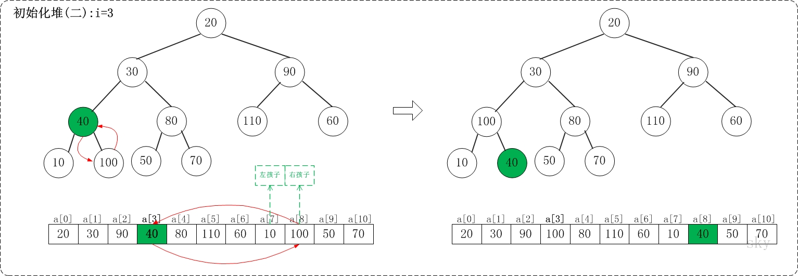
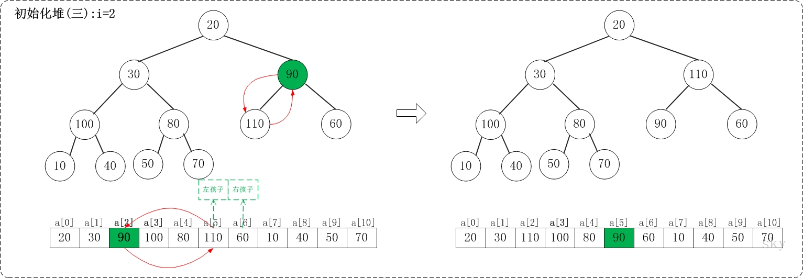

## 堆排序

堆排序(Heapsort)是指利用堆积树（堆）这种数据结构所设计的一种排序算法，它是选择排序的一种。可以利用数组的特点快速定位指定索引的元素。堆分为大根堆和小根堆，是完全二叉树。大根堆的要求是每个节点的值都不大于其父节点的值，即A[PARENT[i]] >= A[i]。在数组的非降序排序中，需要使用的就是大根堆，因为根据大根堆的要求可知，最大的值一定在堆顶。

### 算法原理

1. 先将初始文件R[1..n]建成一个大根堆，此堆为初始的无序区
2. 再将关键字最大的记录R[1]（即堆顶）和无序区的最后一个记录R[n]交换，由此得到新的无序区R[1..n-1]和有序区R[n]，且满足R[1..n-1].keys≤R[n].key
3. 由于交换后新的根R[1]可能违反堆性质，故应将当前无序区R[1..n-1]调整为堆。然后再次将R[1..n-1]中关键字最大的记录R[1]和该区间的最后一个记录R[n-1]交换，由此得到新的无序区R[1..n-2]和有序区R[n-1..n]，且仍满足关系R[1..n-2].keys≤R[n-1..n].keys，同样要将R[1..n-2]调整为堆。
……
直到无序区只有一个元素为止。

以下内容来源于 [skywang12345](http://www.cnblogs.com/skywang12345/p/3602162.html)

下面演示a={20,30,90,40,70,110,60,10,100,50,80}, n=11进行堆排序过程。下面是数组a对应的初始化结构：


* i=11/2-1，即i=4


上面是heapAdjust(a, 4, 9)调整过程。heapAdjust(a, 4, 9)的作用是将a[4...9]进行下调；a[4]的左孩子是a[9]，右孩子是a[10]。调整时，选择左右孩子中较大的一个(即a[10])和a[4]交换。

* i=3


上面是heapAdjust(a, 3, 9)调整过程。heapAdjust(a, 3, 9)的作用是将a[3...9]进行下调；a[3]的左孩子是a[7]，右孩子是a[8]。调整时，选择左右孩子中较大的一个(即a[8])和a[4]交换。

* i=2


上面是heapAdjust(a, 2, 9)调整过程。heapAdjust(a, 2, 9)的作用是将a[2...9]进行下调；a[2]的左孩子是a[5]，右孩子是a[6]。调整时，选择左右孩子中较大的一个(即a[5])和a[2]交换。

* i=1


上面是heapAdjust(a, 1, 9)调整过程。heapAdjust(a, 1, 9)的作用是将a[1...9]进行下调；a[1]的左孩子是a[3]，右孩子是a[4]。调整时，选择左右孩子中较大的一个(即a[3])和a[1]交换。交换之后，a[3]为30，它比它的右孩子a[8]要大，接着，再将它们交换。

* i=0


上面是heapAdjust(a, 0, 9)调整过程。heapAdjust(a, 0, 9)的作用是将a[0...9]进行下调；a[0]的左孩子是a[1]，右孩子是a[2]。调整时，选择左右孩子中较大的一个(即a[2])和a[0]交换。交换之后，a[2]为20，它比它的左右孩子要大，选择较大的孩子(即左孩子)和a[2]交换。

调整完毕，就得到了最大堆。此时，数组{20,30,90,40,70,110,60,10,100,50,80}也就变成了{110,100,90,40,80,20,60,10,30,50,70}。


在将数组转换成最大堆之后，接着要进行交换数据，从而使数组成为一个真正的有序数组。
交换数据部分相对比较简单，下面仅仅给出将最大值放在数组末尾的示意图。


### 算法实现（java）

```java

public class HeapSort implements Sort {

    //

    public int[] sort(int[] nums) {

        int size = nums.length;
		
		// size/2-1 最后一个非叶子节点
        for (int i = size / 2 - 1; i >= 0; --i) {
            heapAdjust(nums, i, nums.length);
        }

        for (int i = size - 1; i > 0; --i) {
            int tmp = nums[0];
            nums[0] = nums[i];
            nums[i] = tmp;
            heapAdjust(nums, 0, i);
        }

        return nums;
    }

    void heapAdjust(int array[], int i, int end) {
        int nChild;
        int nTemp;
        for (; 2 * i + 1 < end; i = nChild) {
            nChild = 2 * i + 1;
            if (nChild < end - 1 && array[nChild + 1] > array[nChild])
                ++nChild;
            if (array[i] < array[nChild]) {
                nTemp = array[i];
                array[i] = array[nChild];
                array[nChild] = nTemp;
            } else
                break;
        }
    }

    public static void main(String[] args) {
        int[] nums = { 2, 3, 21, 3, 4, 434, 5456, 11234, 3, 56, 457, 73, 3 };

        Sort heapSort = new HeapSort();
        heapSort.sort(nums);
        for (int n : nums) {
            System.out.print(n + " ");
        }
    }

}


```

### 时间复杂度
堆排序的时间复杂度是O(N*lgN)。
假设被排序的数列中有N个数。遍历一趟的时间复杂度是O(N)，需要遍历多少次呢？
堆排序是采用的二叉堆进行排序的，二叉堆就是一棵二叉树，它需要遍历的次数就是二叉树的深度，而根据完全二叉树的定义，它的深度至少是lg(N+1)。最多是多少呢？由于二叉堆是完全二叉树，因此，它的深度最多也不会超过lg(2N)。因此，遍历一趟的时间复杂度是O(N)，而遍历次数介于lg(N+1)和lg(2N)之间；因此得出它的时间复杂度是O(N*lgN)。

### 稳定性
堆排序是不稳定的算法，它不满足稳定算法的定义。它在交换数据的时候，是比较父结点和子节点之间的数据，所以，即便是存在两个数值相等的兄弟节点，它们的相对顺序在排序也可能发生变化。
算法稳定性 -- 假设在数列中存在a[i]=a[j]，若在排序之前，a[i]在a[j]前面；并且排序之后，a[i]仍然在a[j]前面。则这个排序算法是稳定的！